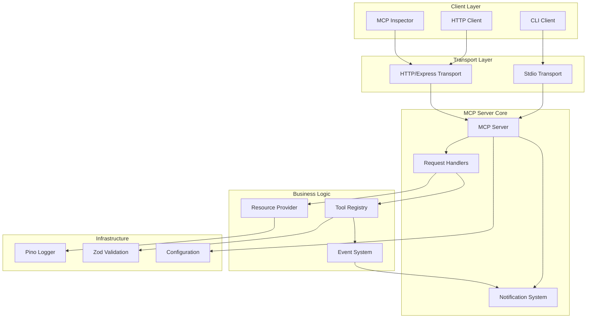
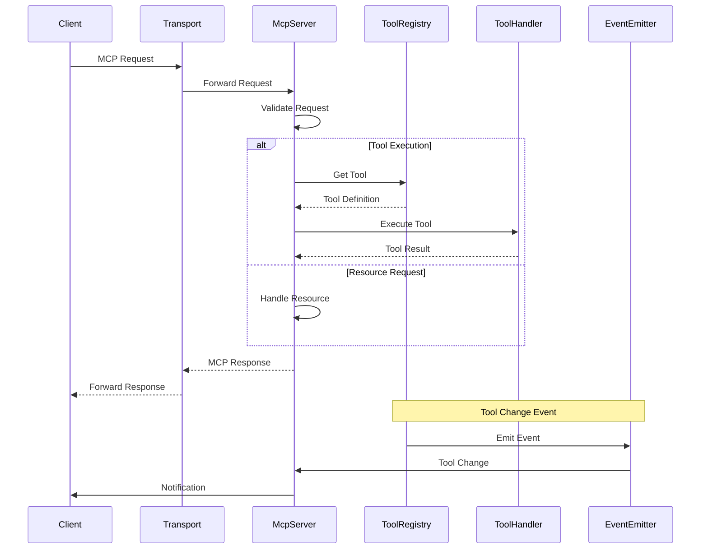
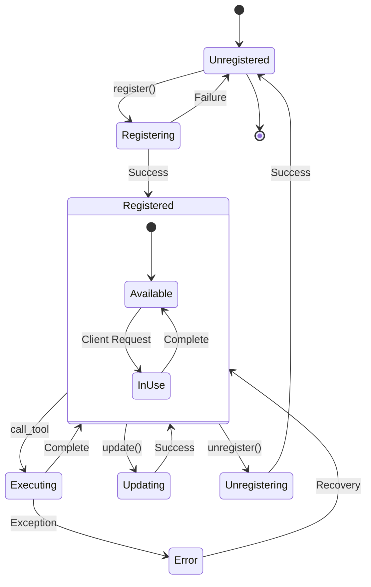
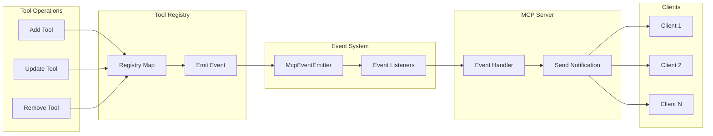
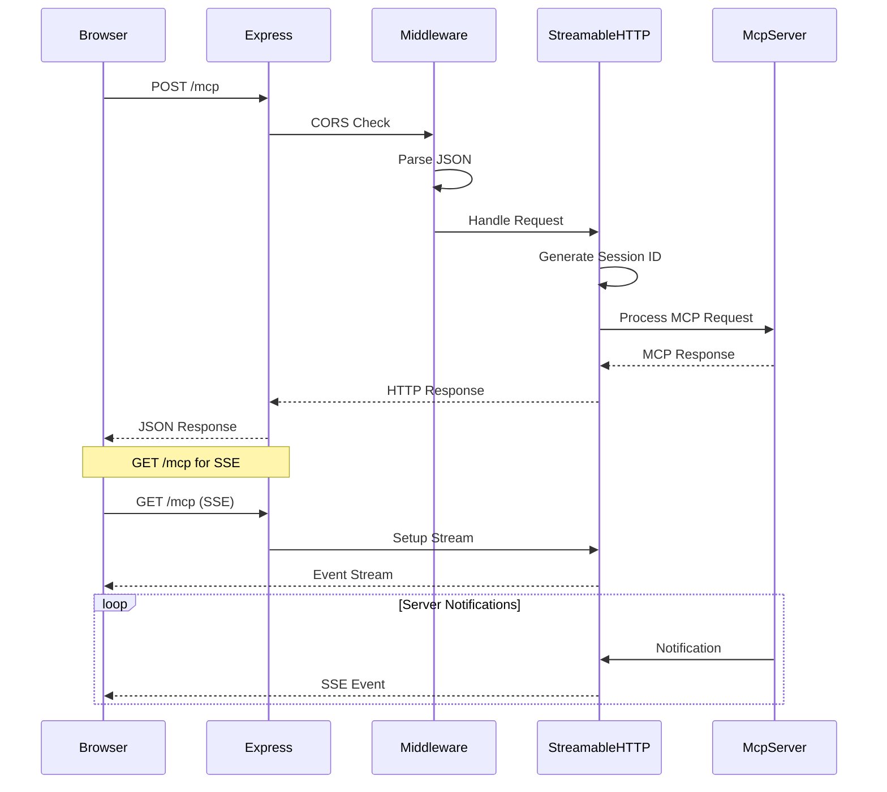
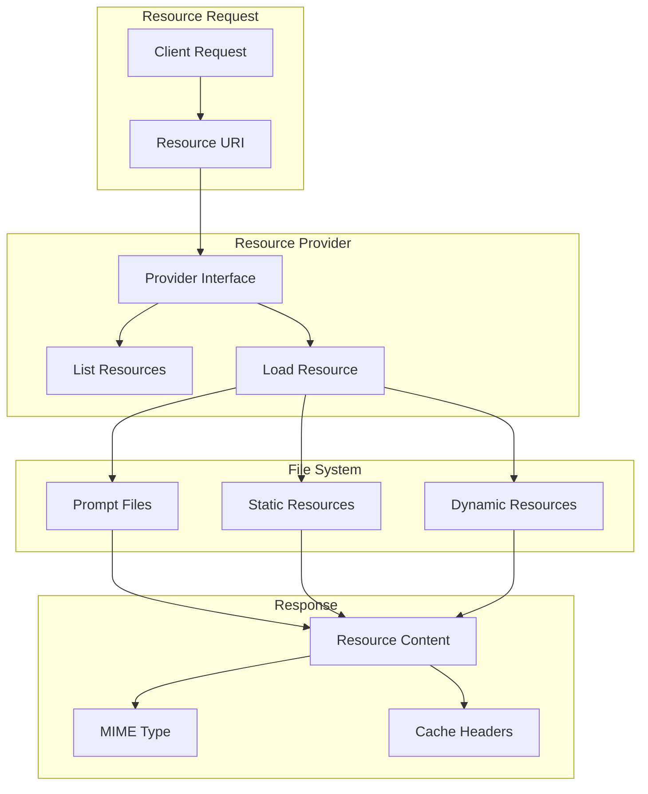
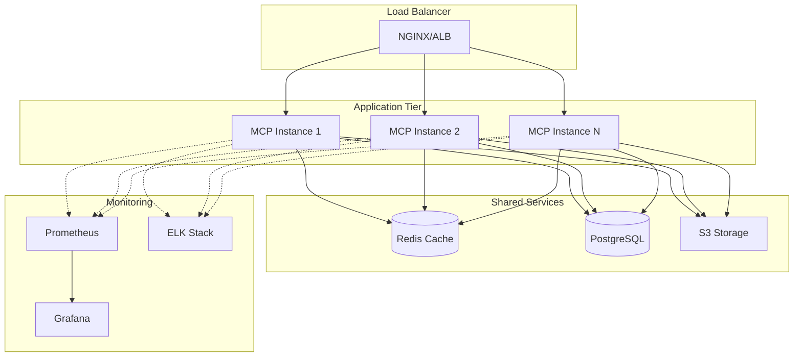
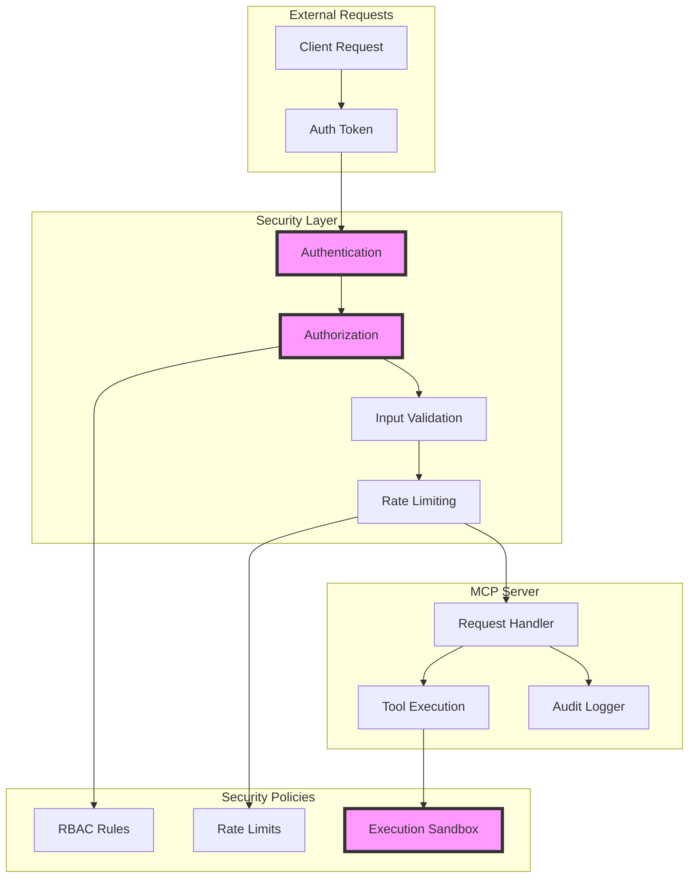
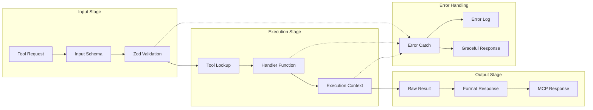
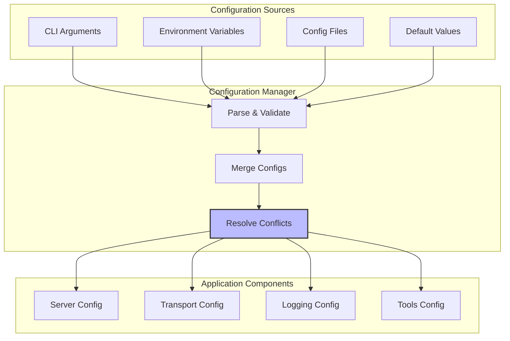

# DingDong MCP Architecture Diagrams

## 1. System Overview

## 2. Component Interaction Diagram

## 3. Tool Lifecycle Diagram

## 4. Event Flow Architecture

## 5. HTTP Transport Request Flow

## 6. Resource Loading Architecture

## 7. Deployment Architecture

## 8. Security Architecture

## 9. Tool Execution Pipeline

## 10. Configuration Flow

## Usage Guide

These diagrams can be rendered using any Mermaid-compatible viewer:
- GitHub/GitLab markdown files
- VS Code with Mermaid extension
- Online editors like mermaid.live
- Documentation tools like MkDocs or Docusaurus

Each diagram focuses on a specific aspect of the DingDong MCP architecture:
1. **System Overview**: High-level component relationships
2. **Component Interaction**: Request/response flow
3. **Tool Lifecycle**: State management for tools
4. **Event Flow**: Event-driven architecture
5. **HTTP Transport**: HTTP-specific request handling
6. **Resource Loading**: Resource management flow
7. **Deployment**: Production deployment topology
8. **Security**: Security layers and controls
9. **Tool Execution**: Tool processing pipeline
10. **Configuration**: Configuration management flow